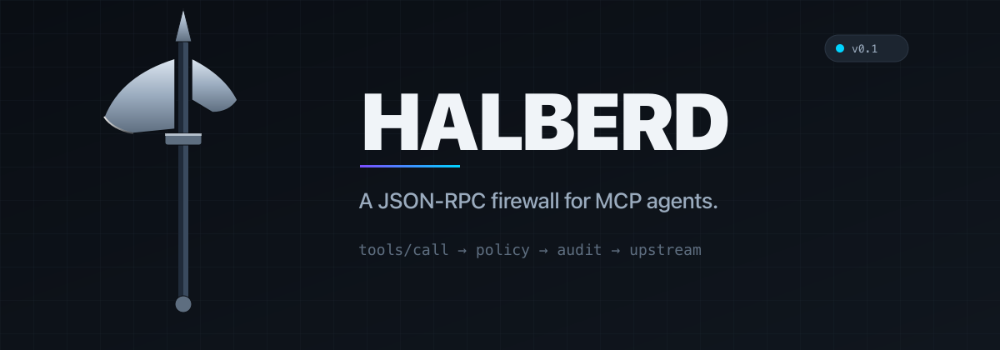
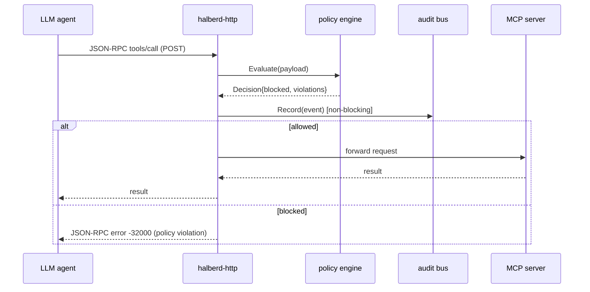

<picture>
  <source media="(prefers-color-scheme: dark)"  srcset="assets/banner-dark.png">
  <source media="(prefers-color-scheme: light)" srcset="assets/banner-light.png">
  
</picture>

[](https://github.com/Builder106/halberd/actions/workflows/ci.yml)
[](https://go.dev/)
[](#license)
[](https://modelcontextprotocol.io)

**Halberd** is a high-throughput reverse proxy that sits between an LLM agent
and its Model Context Protocol (MCP) servers. Every `tools/call` envelope is
parsed, evaluated against a YAML policy bundle, and either forwarded or
blocked with a synthetic JSON-RPC error — before the malicious payload
reaches the host system.

> *`mcp-scan` checks what tools **say** they do. Halberd checks what they
> **actually try** in production.*

## Why this exists

By mid-2026, the dominant attack surface in agentic AI is no longer the model
itself — it's the boundary between the model and the tools it can call.
Halberd defends that boundary against five concrete threats:

| # | Threat | How it shows up |
|---|---|---|
| T1 | Tool poisoning | A compromised MCP server returns a response containing role-tag spoofing or ANSI escapes that hijack the agent's next turn |
| T2 | Argument injection | The agent is tricked into calling a legitimate tool with hostile args (`execute_sql` with `DROP TABLE`, `git_clone` with `--upload-pack`) |
| T3 | Out-of-scope I/O | A tool reads `/etc/shadow`, hits a private IP, or writes outside its sandbox |
| T4 | Capability creep | A server pushes `tools/list_changed` mid-session; a new, unvetted tool appears and gets called |
| T5 | Exfiltration via response | A tool response carries SSH keys, env vars, or other secrets back into the model context |

v0.1 ships full request-side coverage of **T2** and **T4**. T1, T3, and T5
are the v0.2 roadmap.

## How it works



## Quick start

```bash
brew install go
git clone https://github.com/Builder106/halberd && cd halberd
go build -o bin/ ./cmd/...

# Validate a policy bundle:
./bin/halberd lint policies/mcp-server-postgres.yaml

# Run the proxy in front of a postgres MCP server:
./bin/halberd-http \
  --policy policies/mcp-server-postgres.yaml \
  --target http://localhost:8080 \
  --listen :9090 \
  --audit  halberd.jsonl
```

Now point your MCP client at `http://localhost:9090` instead of the
postgres server. Every `tools/call` is logged to `halberd.jsonl`. Try a
`DROP TABLE` from the agent — it'll come back as a JSON-RPC error before
the request ever reaches postgres.

## Policy DSL

```yaml
version: 1
server: mcp-server-postgres
tools:
  - name: query
    arguments:
      sql:
        type: string
        max_length: 8192
        deny_patterns:
          - '(?i)\bdrop\s+(table|database|schema)\b'
          - ';\s*--'                                  # statement chaining
defaults:
  unknown_tool: deny           # T4: block tools not in this bundle
  unknown_method: log_and_pass
```

Full reference: [docs/policy-dsl.md](docs/policy-dsl.md).

## Roadmap

| Phase | Status | Outcome |
|---|---|---|
| **P1** — HTTP reverse proxy + audit bus | shipped in v0.1 | `halberd-http` forwards JSON-RPC, logs every decision |
| **P2** — Policy engine, deny-pattern blocking, T2 + T4 coverage | shipped in v0.1 | YAML bundles, regex denylist, capability-creep guard |
| **P3** — stdio transport | planned | PTY wrapper for local MCP servers (Claude Desktop, Cursor) |
| **P4** — Response inspection | planned | SSE-aware streaming inspection, T1 + T5 coverage |
| **P5** — Rule packs + hardening | planned | Pre-built bundles for filesystem / git / postgres / github |

## Performance

The policy engine is the hot path. Targets enforced in CI:

| Metric | Ceiling |
|---|---|
| p50 added latency per `tools/call` | 200 µs |
| p99 added latency | 1 ms |
| Allocations per call | 50 |
| Throughput (4-core proxy instance) | 50k req/s |

Reproduce locally with `go test -bench=. -benchmem ./internal/policy`.

## Architecture

- [`cmd/halberd-http`](cmd/halberd-http/main.go) — the reverse-proxy binary
- [`cmd/halberd`](cmd/halberd/main.go) — operator CLI (`halberd lint …`)
- [`internal/policy`](internal/policy/) — IO-free policy engine
- [`internal/jsonrpc`](internal/jsonrpc/) — JSON-RPC 2.0 envelope + error synthesis
- [`internal/audit`](internal/audit/) — non-blocking audit bus → JSONL
- [`internal/transport/http`](internal/transport/http/) — `httputil.ReverseProxy` wrapper
- [`policies/`](policies/) — rule packs (data, not code)

## Related work

- **[`mcp-scan`](https://github.com/invariantlabs-ai/mcp-scan)** — static
  analysis of MCP server source. Complementary to Halberd (static vs.
  runtime).
- **Cloudflare AI Gateway / Portkey** — LLM-side proxies, inspect prompts and
  completions, not tool-call envelopes. Different layer.
- **Microsoft RAMPART** — fuzzing harness for agentic security testing.
  Test-time, not prod-time.

## Contributing

See [CONTRIBUTING.md](CONTRIBUTING.md). The "out of scope" list near the
bottom is worth reading before opening a PR.

## License

MIT. See [LICENSE](LICENSE).
