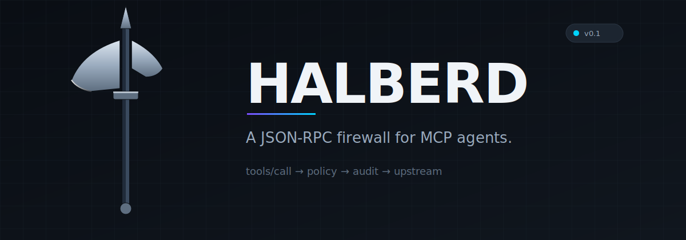
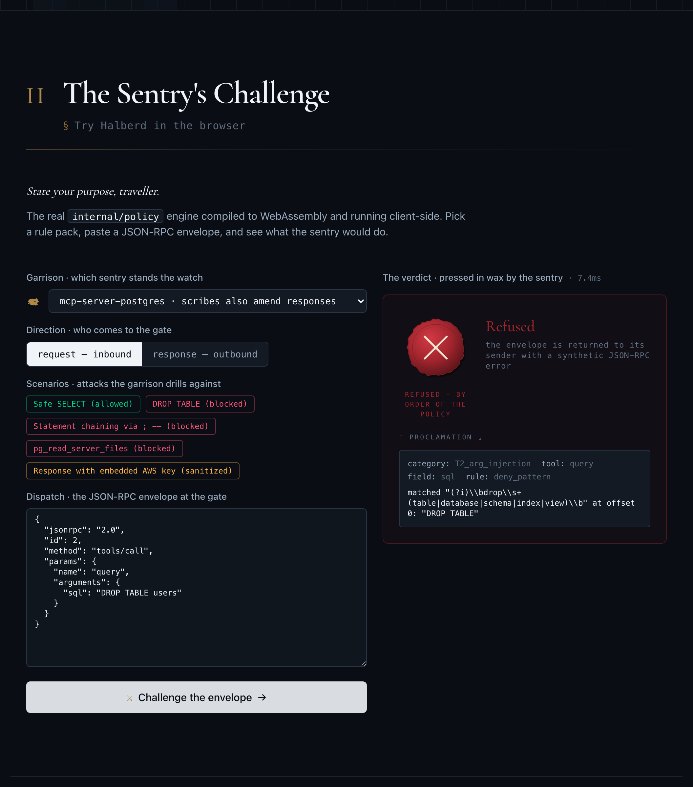
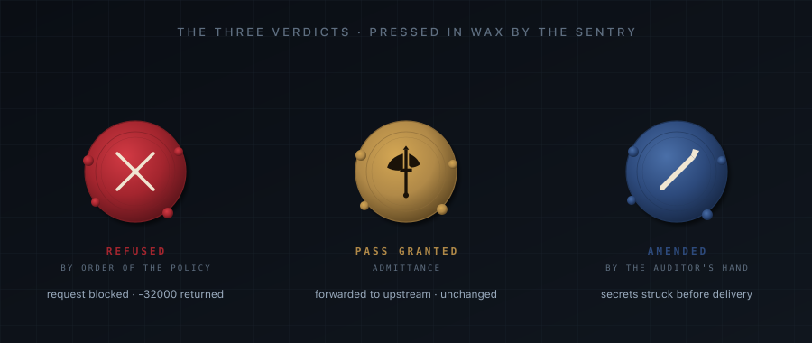
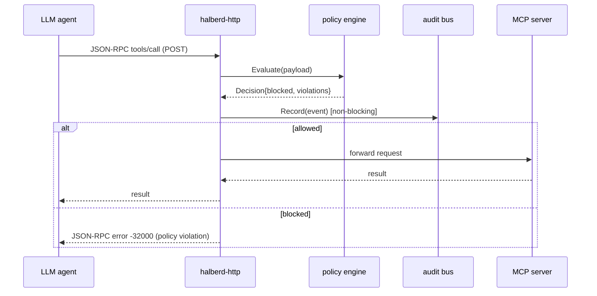

<picture>
  <source media="(prefers-color-scheme: dark)"  srcset="assets/banner-dark.svg">
  <source media="(prefers-color-scheme: light)" srcset="assets/banner-light.svg">
  
</picture>

[](https://github.com/Builder106/halberd/actions/workflows/ci.yml)
[](https://go.dev/)
[](#license)
[](https://modelcontextprotocol.io)
[](https://halberd-keep.vercel.app)

**Halberd** is a high-throughput reverse proxy that sits between an LLM agent
and its Model Context Protocol (MCP) servers. Every `tools/call` envelope is
parsed, evaluated against a YAML policy bundle, and either forwarded or
blocked with a synthetic JSON-RPC error — before the malicious payload
reaches the host system.

> **Try it in the browser:** [halberd-keep.vercel.app](https://halberd-keep.vercel.app) — the real `internal/policy` engine compiled to WebAssembly. Pick a rule pack, paste a `tools/call`, see the decision.

<a href="https://halberd-keep.vercel.app">
  
</a>

Every challenge resolves to one of three verdicts, pressed in wax by the sentry:



### See it in motion

A `DROP TABLE` under the postgres bundle, refused with a red wax seal:


<sub>Recorded against the live site by the <a href="web/e2e/demo/">Gherkin demo suite</a>. Re-record locally with <code>cd web && npm run demo</code>. Higher-quality H.264 mp4 alongside each clip: <a href="assets/demo/refused-drop-table.mp4">refused-drop-table.mp4</a>.</sub>

<details>
<summary><strong>⚔ Refused</strong> — another scenario from the same cluster: path-traversal blocked under the filesystem bundle</summary>


<sub>mp4: <a href="assets/demo/refused-path-traversal.mp4">refused-path-traversal.mp4</a></sub>

</details>

<details>
<summary><strong>✎ Amended</strong> — the auditor strikes AWS / GitHub / RSA secrets from a response (T1 + T5)</summary>

![Halberd amending a response containing fake AWS, GitHub, and RSA secrets under the honeypot bundle: blue ink seal with three struck detections, rewritten payload shows [REDACTED]](assets/demo/amended-aws-github-rsa-laden-response.gif)

<sub>mp4: <a href="assets/demo/amended-aws-github-rsa-laden-response.mp4">amended-aws-github-rsa-laden-response.mp4</a></sub>

</details>

<details>
<summary><strong>⛨ Pass granted</strong> — a safe SELECT reaches the upstream unchanged (Halberd is a firewall, not a wall)</summary>


<sub>mp4: <a href="assets/demo/granted-safe-select.mp4">granted-safe-select.mp4</a></sub>

</details>

> *`mcp-scan` checks what tools **say** they do. Halberd checks what they
> **actually try** in production.*

## Why this exists

By mid-2026, the dominant attack surface in agentic AI is no longer the model
itself — it's the boundary between the model and the tools it can call.
Halberd defends that boundary against five concrete threats:

| # | Threat | How it shows up |
|---|---|---|
| T1 | Tool poisoning | A compromised MCP server returns a response containing role-tag spoofing or ANSI escapes that hijack the agent's next turn |
| T2 | Argument injection | The agent is tricked into calling a legitimate tool with hostile args (`execute_sql` with `DROP TABLE`, `git_clone` with `--upload-pack`) |
| T3 | Out-of-scope I/O | A tool reads `/etc/shadow`, hits a private IP, or writes outside its sandbox |
| T4 | Capability creep | A server pushes `tools/list_changed` mid-session; a new, unvetted tool appears and gets called |
| T5 | Exfiltration via response | A tool response carries SSH keys, env vars, or other secrets back into the model context |

v0.1 covers **T1**, **T2**, **T4**, and **T5** over both **HTTP** and
**stdio** transports. T3 (out-of-scope I/O) is the v0.2 roadmap.

## How it works



## Install

**Pre-built binaries** for linux/darwin × amd64/arm64 ship with every
release. Grab the archive matching your platform from the [latest
release](https://github.com/Builder106/Halberd/releases/latest); each
tarball bundles all four binaries plus `LICENSE`, `README.md`,
`CONTRIBUTING.md`, the example bundle, and every rule pack.

```bash
curl -L https://github.com/Builder106/Halberd/releases/latest/download/halberd_${VERSION}_${OS}_${ARCH}.tar.gz \
  | tar -xz
./halberd version
```

**Build from source:**

```bash
brew install go
git clone https://github.com/Builder106/Halberd && cd Halberd
go build -o bin/ ./cmd/...

# Validate a policy bundle:
./bin/halberd lint policies/mcp-server-postgres.yaml
```

### Bundled rule packs

| Pack | Threats covered | Note |
|---|---|---|
| [`mcp-server-postgres.yaml`](policies/mcp-server-postgres.yaml) | T2 (DROP/TRUNCATE/COPY-from-program/`pg_read_server_files`), T5 (secrets in result rows) | Ready to use as-is |
| [`mcp-server-filesystem.yaml`](policies/mcp-server-filesystem.yaml) | T2 (path traversal, absolute paths, home-dir expansion, null-byte injection), T5 (secrets in file contents) | Array-arg tools (`read_multiple_files`, `edit_file`) intentionally denied — v0.1 DSL is scalar-only |
| [`mcp-server-git.yaml`](policies/mcp-server-git.yaml) | T2 (`--upload-pack=…`-style long-opt smuggling in ref/branch names; path traversal in `repo_path`), T5 | State-mutating tools (`commit`, `add`, `reset`, `init`) denied by default |
| [`mcp-server-github.yaml`](policies/mcp-server-github.yaml) | T3 (owner-outside-allowlist; **edit `your-org` before deploying**), T2 (repo-name shell metacharacters), T5 | Truly dangerous tools (`delete_repository`, `transfer_repository`) omitted entirely |
| [`halberd-honeypot.yaml`](policies/halberd-honeypot.yaml) | T1, T2, T3, T5 (the full v0.1 surface) | Matched bundle for [`cmd/halberd-honeypot`](cmd/halberd-honeypot/); demo-only |

### Try the full v0.1 surface against the honeypot

Halberd ships with a deliberately-vulnerable MCP server,
[`cmd/halberd-honeypot`](cmd/halberd-honeypot/), whose tool outputs
are the threats themselves. Pair it with `halberd-stdio` and the
matched bundle for a one-command end-to-end demo:

```bash
go build -o bin/ ./cmd/...

bin/halberd-stdio \
  --policy policies/halberd-honeypot.yaml \
  --audit  halberd.jsonl \
  -- bin/halberd-honeypot
```

Pipe in a `tools/call` for `execute_sql` with `DROP TABLE`, or `read_file`
with `../../etc/passwd`, or `list_users` (the response carries fake
AWS / GitHub / RSA secrets) — and watch Halberd block, redact, and audit
each one. See [`cmd/halberd-honeypot/README.md`](cmd/halberd-honeypot/README.md)
for the full threat-coverage table.

<details>
<summary><strong>▶ Watch it run</strong> — 30s terminal cast: DROP TABLE refused, secrets redacted, audit log captured</summary>


<sub>The cast is scripted under <a href="scripts/demo/honeypot-demo.sh">scripts/demo/honeypot-demo.sh</a> and re-recorded via <code>asciinema rec --command ./scripts/demo/honeypot-demo.sh assets/honeypot-demo.cast</code> + <code>agg --theme github-dark</code>. mp4: <a href="assets/honeypot-demo.mp4">honeypot-demo.mp4</a></sub>

</details>

### Option A — remote MCP server (HTTP transport)

```bash
./bin/halberd-http \
  --policy policies/mcp-server-postgres.yaml \
  --target http://localhost:8080 \
  --listen :9090 \
  --audit  halberd.jsonl
```

Point your MCP client at `http://localhost:9090` instead of the postgres
server. Every `tools/call` is logged. Try a `DROP TABLE` — Halberd
returns a JSON-RPC error before the request reaches postgres.

### Option B — local stdio server (Claude Desktop, Cursor, Windsurf)

Drop `halberd-stdio` into the host's MCP server config in place of the
real server command. For Claude Desktop, edit
`~/Library/Application Support/Claude/claude_desktop_config.json`:

```json
{
  "mcpServers": {
    "postgres": {
      "command": "/usr/local/bin/halberd-stdio",
      "args": [
        "--policy", "/etc/halberd/postgres.yaml",
        "--audit",  "/var/log/halberd/postgres.jsonl",
        "--",
        "mcp-server-postgres", "--conn-string", "postgresql://..."
      ]
    }
  }
}
```

Restart Claude Desktop. Every JSON-RPC message between Claude and
`mcp-server-postgres` now flows through Halberd. Argument-injection
attempts (`DROP TABLE`, statement chaining via `; --`, etc.) come back
to Claude as JSON-RPC errors that the model can reason about, and the
upstream server never sees the blocked payload.

## Policy DSL

```yaml
version: 1
server: mcp-server-postgres
tools:
  - name: query
    arguments:
      sql:
        type: string
        max_length: 8192
        deny_patterns:
          - '(?i)\bdrop\s+(table|database|schema)\b'
          - ';\s*--'                                  # statement chaining
defaults:
  unknown_tool: deny           # T4: block tools not in this bundle
  unknown_method: log_and_pass
```

Full reference: [docs/policy-dsl.md](docs/policy-dsl.md).

## Roadmap

| Phase | Status | Outcome |
|---|---|---|
| **P1** — HTTP reverse proxy + audit bus | shipped in v0.1 | `halberd-http` forwards JSON-RPC, logs every decision |
| **P2** — Policy engine, deny-pattern blocking, T2 + T4 coverage | shipped in v0.1 | YAML bundles, regex denylist, capability-creep guard |
| **P3** — stdio transport | shipped in v0.1 | `halberd-stdio` MITMs local MCP servers (Claude Desktop, Cursor, Windsurf) over line-delimited JSON-RPC |
| **P4** — Response inspection | shipped in v0.1 | JSON-tree walk on every response: strip ANSI / zero-width Unicode, redact AWS / GitHub / RSA secrets. T1 + T5 coverage. (SSE per-event inspection on v0.2 roadmap.) |
| **P5** — Rule packs + hardening | shipped in v0.1 | Pre-built bundles for `mcp-server-{filesystem,git,github,postgres}`; per-pack threat tests; audit-bus coverage closed; CI actions bumped to Node-24-native versions. |

## Performance

The policy engine is the hot path. Targets enforced in CI:

| Metric | Ceiling |
|---|---|
| p50 added latency per `tools/call` | 200 µs |
| p99 added latency | 1 ms |
| Allocations per call | 50 |
| Throughput (4-core proxy instance) | 50k req/s |

Reproduce locally with `go test -bench=. -benchmem ./internal/policy`.

## Architecture

- [`cmd/halberd-http`](cmd/halberd-http/main.go) — the reverse-proxy binary
- [`cmd/halberd-stdio`](cmd/halberd-stdio/main.go) — the stdio MITM wrapper binary
- [`cmd/halberd`](cmd/halberd/main.go) — operator CLI (`halberd lint …`)
- [`cmd/halberd-honeypot`](cmd/halberd-honeypot/) — deliberately-vulnerable MCP server for demos and integration tests
- [`internal/policy`](internal/policy/) — IO-free policy engine
- [`internal/jsonrpc`](internal/jsonrpc/) — JSON-RPC 2.0 envelope + error synthesis
- [`internal/audit`](internal/audit/) — non-blocking audit bus → JSONL
- [`internal/transport/http`](internal/transport/http/) — `httputil.ReverseProxy` wrapper
- [`internal/transport/stdio`](internal/transport/stdio/) — bidirectional JSON-RPC pipe with policy MITM
- [`policies/`](policies/) — rule packs (data, not code)

## Related work

- **[`mcp-scan`](https://github.com/invariantlabs-ai/mcp-scan)** — static
  analysis of MCP server source. Complementary to Halberd (static vs.
  runtime).
- **Cloudflare AI Gateway / Portkey** — LLM-side proxies, inspect prompts and
  completions, not tool-call envelopes. Different layer.
- **Microsoft RAMPART** — fuzzing harness for agentic security testing.
  Test-time, not prod-time.

## Contributing

See [CONTRIBUTING.md](CONTRIBUTING.md). The "out of scope" list near the
bottom is worth reading before opening a PR.

## Branding assets

- [`assets/banner-{dark,light}.svg`](assets/) — README banner (1200×420), light/dark variants swapped via `<picture>`.
- [`assets/social-preview.svg`](assets/social-preview.svg) + [`.png`](assets/social-preview.png) — 1200×630 social-preview card. Upload the PNG via **Settings → Social preview → Upload an image** to populate GitHub's link-share card.
- [`assets/favicon.svg`](assets/favicon.svg) + [`assets/apple-touch-icon.png`](assets/apple-touch-icon.png) — favicon (designed for 32×32 legibility) and iOS home-screen icon (180×180 on solid background).

## License

MIT. See [LICENSE](LICENSE).
